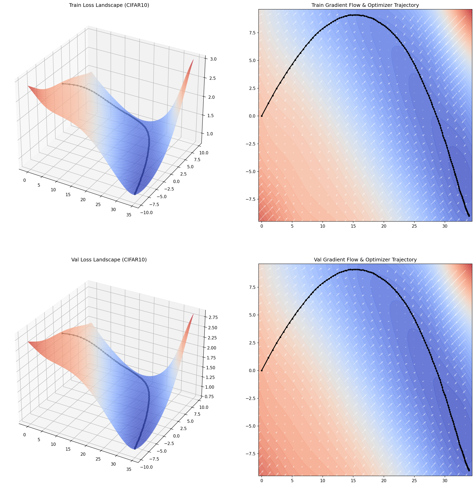

# STAM: Subspace Trajectory Anchored Mapping

<div align="center">

**A Mathematically Rigorous, Computationally Scalable Neural Network Loss Landscape Visualizer**

[](https://python.org)
[](https://pytorch.org)
[](https://matplotlib.org)
[](https://scipy.org)
[](https://www.apache.org/licenses/LICENSE-2.0)

</div>

---

## The Problem

Understanding *why* and *how* a neural network learns is one of the most fundamental challenges in modern machine learning research. The loss landscape — the geometric surface of the objective function L(θ) over the parameter space R^N — encodes everything: the presence of sharp minima, flat valleys, saddle points, and the forces that drive the optimizer through them.

Yet, for a network with even a modest 10 million parameters, the parameter space is a 10,000,000-dimensional manifold. Directly observing this manifold is mathematically impossible. Researchers have historically resorted to projecting it onto an arbitrary 2D plane defined by two randomly chosen Gaussian vectors. This approach, while simple, introduces a critical, irrecoverable flaw: **random projection distortion**. When the true trajectory of the optimizer is projected onto a plane that was not constructed to contain it, the path appears artificially compressed, distorted, or even non-monotonic, yielding a fundamentally misleading picture of the optimization dynamics.

Worse, even after choosing a projection plane, computing the loss landscape over a standard 100×100 grid requires **10,000 full forward passes** over the dataset. For models with billions of parameters trained on datasets like ImageNet, this is computationally intractable, taking days or weeks on state-of-the-art hardware.

**STAM (Subspace Trajectory Anchored Mapping)** is a framework that resolves both of these fundamental problems with mathematical rigor.

---

## Core Innovations

STAM is built on four interconnected technical contributions, each solving a distinct failure mode of prior visualization methods.

### 1. Zero-Distortion Orthogonal Subspace Construction via SVD

The root cause of distortion in traditional visualizations is the choice of projection plane. If the plane does not contain the optimizer's trajectory, any projection of that trajectory onto it will be a distorted shadow. STAM eliminates this by deriving the projection plane *from the trajectory itself*.

STAM records the complete sequence of parameter vectors visited by the optimizer throughout training, forming the **displacement matrix** D in R^(T x N). It then performs **Singular Value Decomposition (SVD)** on this matrix. By the **Eckart-Young-Mirsky Theorem**, the first two right singular vectors v1, v2 of D form the rank-2 orthonormal basis that captures the **maximum geometric variance** of the optimizer's true path. The projection of the trajectory onto the plane spanned by {v1, v2} is, in a precise mathematical sense, the best possible 2D representation of an N-dimensional trajectory. There is no distortion. The trajectory is displayed in the plane where it actually lives, to the highest degree possible in 2D.

### 2. Sparse Anchor Evaluation with O(1)-Scalable RBF Interpolation

STAM avoids the O(n^2) scaling disaster of dense grid evaluation by separating the evaluation problem from the rendering problem. Instead of evaluating 10,000 points, STAM evaluates only 49 (a 7×7 sparse grid). Because it evaluates so few anchors, it can afford to compute the true empirical loss and the true empirical gradient at each anchor over a large fraction of the training dataset, driving stochastic noise towards zero. The result is a sparse but highly accurate geometric skeleton of the loss manifold.

STAM then employs **Radial Basis Function (RBF) Interpolation** — specifically the multiquadric kernel — to upsample this 49-point skeleton into a high-fidelity 100×100 surface in milliseconds. Since neural network loss landscapes are known to be smooth, locally Lipschitz-continuous manifolds (especially in the low-dimensional subspace extracted by PCA), RBF interpolation recovers the topology with high fidelity. The gradient vector field is simultaneously interpolated using a linear RBF kernel, ensuring the quiver plots remain physically accurate across the entire render surface.

### 3. Animated Stochastic "Breathing" Landscape via Taylor Expansion

The global loss landscape L_global(θ) is a mathematical ideal that no optimizer ever actually navigates. In Stochastic Gradient Descent, the optimizer computes gradients on random mini-batches, effectively navigating a **constantly shifting, noisy local landscape** L_batch(θ) that changes at every step. Visualizing this stochastic landscape is a problem no prior tool has solved, because it would require re-evaluating the entire landscape for every single training step.

STAM solves this with a physics-inspired approximation. During training, it captures the mini-batch gradient g_batch^(t) at every recorded step t. The **stochastic noise vector** at step t is then the deviation eta_t = g_batch^(t) - g_global^(t), projected onto the STAM basis. At each animation frame, STAM applies a **localized first-order Taylor Expansion** to the global loss surface, using eta_t as the tilt parameters and a Gaussian envelope to ensure the warp decays smoothly away from the optimizer's current position. This dynamically morphs the rendered surface into the local mini-batch surface — with zero additional forward passes — generating the "breathing" effect that physically demonstrates how stochastic noise kicks the optimizer through the topology.

### 4. Empirical Gradient Flow Vector Fields

At each sparse anchor, STAM computes the full N-dimensional gradient vector ∇L(θ_anchor) and projects it onto the STAM basis via dot products with v1 and v2. The resulting 2D projected gradient field is then overlaid on the contour map as a quiver (vector arrow) plot. This is not a symbolic or approximate representation of the gradient; it is the exact empirical gradient of the objective function, projected into the visualization plane. The quiver plot constitutes a direct visual proof of the "gravitational" forces of the loss topology, explicitly demonstrating *why* the optimizer moves in the direction it does.

---

## Project Structure

```
stam/
├── main.py                   # Pipeline entry point
├── src/
│   ├── config.py             # All hyperparameters and settings
│   ├── data_loader.py        # MNIST / CIFAR-10 data loading
│   ├── models.py             # Model definitions
│   ├── train.py              # Training loop with trajectory & gradient capture
│   ├── landscape.py          # STAM core: SVD basis, anchor evaluation, RBF interpolation
│   └── plotter.py            # Static 3D/2D rendering and animated GIF generation
├── data/                     # Auto-downloaded datasets
├── visualization/            # Output directory for PNG and GIF artifacts
├── theory.md                 # Full mathematical derivation of the STAM framework
└── README.md
```

---

## Installation

**Prerequisites:** Python 3.11+, pip

```bash
# 1. Clone the repository
git clone https://github.com/tasmaikeni13/STAM.git
cd STAM

# 2. Install dependencies
pip install torch torchvision numpy matplotlib scipy
```

GPU acceleration is automatically used if CUDA is available (`torch.cuda.is_available()`). The pipeline is designed to run on CPU as well, though GPU is strongly recommended for the training phase.

---

## Configuration

All parameters are centralized in [`src/config.py`](src/config.py).

| Parameter | Default | Description |
|---|---|---|
| `DATASET` | `'CIFAR10'` | Dataset to use. Options: `'MNIST'`, `'CIFAR10'` |
| `EPOCHS` | `10` | Number of training epochs for trajectory capture |
| `BATCH_SIZE` | `64` | Mini-batch size during training |
| `LR` | `1e-3` | AdamW learning rate |
| `WEIGHT_DECAY` | `1e-4` | AdamW weight decay (L2 regularization coefficient) |
| `SPARSE_GRID_RESOLUTION` | `7` | Size of the sparse anchor grid (7 → 49 total anchor points) |
| `RENDER_RESOLUTION` | `100` | Size of the final upsampled render grid (100 → 10,000 rendered points) |
| `GRID_MARGIN` | `0.5` | Margin added around the trajectory bounds when defining the grid extent |

---

## Usage

```bash
# Run the full STAM pipeline (training → SVD → landscape evaluation → rendering)
python main.py
```

The pipeline executes in the following sequence:

1. **Data Loading** — Downloads and prepares the configured dataset.
2. **Training** — Trains the model using AdamW, recording the parameter vector θ_t and mini-batch gradient g_batch^(t) at every 50th batch step.
3. **SVD Basis Computation** — Builds the displacement matrix D and computes the STAM orthonormal basis {v1, v2} via SVD.
4. **Trajectory Projection** — Projects the full high-dimensional trajectory T onto the STAM 2D plane.
5. **Landscape Evaluation** — Evaluates the true training and validation loss, and the empirical gradient, at each of the 49 sparse anchor points.
6. **RBF Upsampling** — Interpolates the sparse anchor data to the full 100×100 render grid using multiquadric RBF for the loss surfaces and linear RBF for the gradient field.
7. **Static Rendering** — Generates a high-resolution PNG with the 3D loss surface and the 2D gradient flow quiver plot.
8. **Animated Rendering** — Generates an animated GIF with the stochastic breathing landscape and the live optimizer trajectory.

---

## Outputs

All outputs are saved to `./visualization/`. The visualizer generates a **2x2 grid layout** that simultaneously displays:
1. **Top-Left**: 3D Training Loss Landscape
2. **Top-Right**: 2D Training Contour & Empirical Gradient Quiver Field
3. **Bottom-Left**: 3D Validation Loss Landscape
4. **Bottom-Right**: 2D Validation Contour & Gradient Quiver Field

| File | Description |
|---|---|
| `stam_landscape_{DATASET}.png` | High-resolution static 2x2 visualization of the final optimization state. |
| `stam_landscape_{DATASET}.gif` | Animated 2x2 visualization. The 3D loss surfaces dynamically breathe and warp (Taylor Expansion) as the optimizer traverses them, while the live trajectory traces the path through the vector fields. |

<p align="center">
  
</p>

<p align="center">
  
</p>

### Live Tracking Mode
When `LIVE_TRAINING=True` in `config.py`, STAM operates in real-time. It runs a brief "burn-in" phase to extract the optimal PCA basis from early optimization dynamics, evaluates the sparse grid, and then opens a live interactive matplotlib window. You can watch the optimizer navigate the 2x2 landscape matrix **while the model is actively training**.

---

## The STAM Pipeline at a Glance

```
Training Loop
    │
    ├─ θ_t (parameter snapshot)  ──────────────────┐
    └─ g_batch (mini-batch gradient snapshot)       │
                                                    ▼
                                     Displacement Matrix D
                                                    │
                                              SVD(D)
                                                    │
                                         ┌──────────┴──────────┐
                                         v1 (PCA 1)      v2 (PCA 2)
                                                    │
                                      Sparse 7×7 Anchor Grid
                                                    │
                                    For each anchor θ(α, β):
                                    ├─ Evaluate L_train(θ)
                                    ├─ Evaluate L_val(θ)
                                    └─ Compute ∇L(θ), project → (gx, gy)
                                                    │
                                         RBF Interpolation
                                                    │
                                      100×100 Dense Render Grid
                                                    │
                              ┌─────────────────────┴──────────────────────┐
                              │                                              │
                       Static PNG                                    Animated GIF
                   (3D Surface + Quiver)                 (Breathing Landscape + Live Trajectory)
```

---

## Comparison with Prior Work

| Method | Projection Quality | Computational Cost | Stochastic Landscape | Gradient Field |
|---|---|---|---|---|
| Random Gaussian Vectors (Li et al., 2018) | ❌ High Distortion | ❌ O(n²) Grid Eval | ❌ No | ❌ No |
| Filter Normalization (Li et al., 2018) | ⚠️ Reduced Distortion | ❌ O(n²) Grid Eval | ❌ No | ❌ No |
| PCA of Trajectory (Conceptual) | ✅ Zero Distortion | ❌ O(n²) Grid Eval | ❌ No | ❌ No |
| **STAM (This Work)** | ✅ **Zero Distortion** | ✅ **O(1) Sparse + RBF** | ✅ **Yes (Taylor)** | ✅ **Yes (Empirical)** |

---

## Mathematical Background

For the full mathematical derivation of all four STAM components — including the Eckart-Young-Mirsky optimality proof, the multiquadric RBF kernel derivation, and the Taylor Expansion breathing formulation — see [`theory.md`](theory.md).

---

## Key References

- Li, H., Xu, Z., Taylor, G., Studer, C., & Goldstein, T. (2018). [Visualizing the Loss Landscape of Neural Nets](https://arxiv.org/abs/1712.09913). *NeurIPS 2018*.
- Garipov, T., Izmailov, P., Podoprikhin, D., Vetrov, D., & Wilson, A. G. (2018). [Loss Surfaces, Mode Connectivity, and Fast Ensembling of DNNs](https://arxiv.org/abs/1802.10026). *NeurIPS 2018*.
- Goodfellow, I., Vinyals, O., & Saxe, A. (2015). [Qualitatively Characterizing Neural Network Optimization Problems](https://arxiv.org/abs/1412.6544). *ICLR 2015*.
- Eckart, C., & Young, G. (1936). The approximation of one matrix by another of lower rank. *Psychometrika, 1*(3), 211–218.
- Hardy, R. L. (1971). Multiquadric equations of topography and other irregular surfaces. *Journal of Geophysical Research, 76*(8), 1905–1915.

---

## License

This project is licensed under the **Apache License 2.0**. See the [Apache 2.0 License](https://www.apache.org/licenses/LICENSE-2.0) for details.
