# STAM — Subspace Taylor Anchored Mapping

**Loss-landscape visualisation that is cheap, and that states its own error.**

<p align="center">
  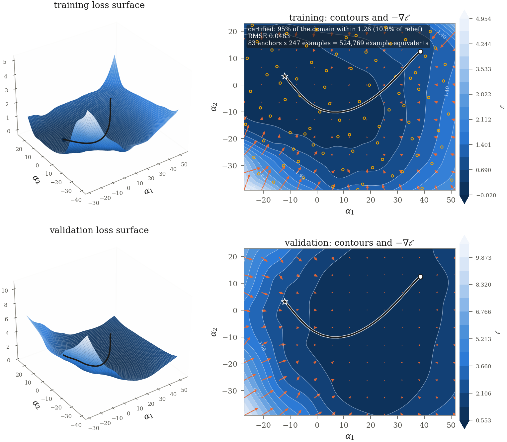
</p>

A loss-landscape figure is a claim about geometry. People read basin widths off them,
compare sharpness between minima, and explain optimiser behaviour from the gradient
field. Those are quantitative claims made from pictures that carry no error bar — and
that are usually produced by evaluating the loss on a grid with a mini-batch per point,
trading a cost you can see for an error you cannot.

STAM treats the problem as what it is: **budgeted stochastic function estimation on a
2-plane**. Fix a compute budget, and how to spend it has a definite answer.

📄 **[Read the paper](paper/stam.pdf)** · 🔬 **[Lean proofs](proofs/StamCert/StamCert/Certificates.lean)** · ⚙️ **[Reproduce](#reproducing)**

---

## Use it on your own model

```bash
pip install -e .
```

Two lines in a training loop you already have:

```python
from stam import LandscapeRecorder

def loss_fn(model, batch):
    x, y = batch
    return F.cross_entropy(model(x), y, reduction="none")   # per-example is best

recorder = LandscapeRecorder(model, loss_fn, eval_batches, every=50)

for batch in loader:
    recorder.zero_grad()
    loss_fn(model, batch).mean().backward()
    optimizer.step()
    recorder.step()                                          # <- 1

report = recorder.render("stam_out", budget_seconds=60)      # <- 2
print(report.summary())
# stam_out/landscape_model.png: 806 anchors x 2048 examples;
# 95% of the domain within 0.00891 (1.2% of relief)
```

You get `landscape_<name>.png` / `.pdf`, an animated `.gif` of the mini-batch surface,
an `.npz` of every array, and a `report_<name>.json` with the certificate, the plane
spectrum, the allocation and the measured cost model.

<p align="center">
  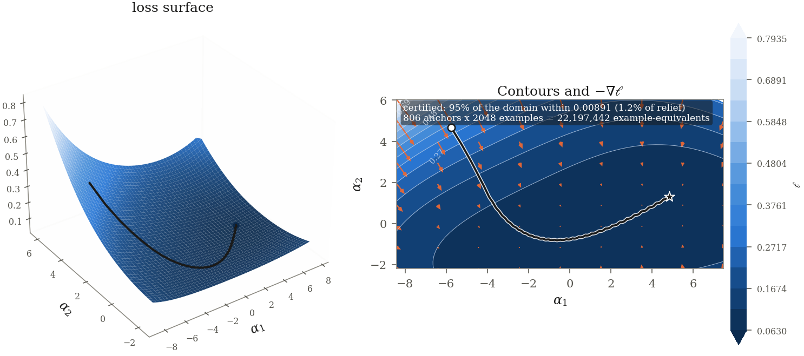
</p>

**What you supply.** Any `nn.Module`; a `loss_fn(model, batch) -> Tensor` returning
per-example losses (preferred — it gives the certificate its variance estimate for free)
or a scalar; and `eval_batches`, any sequence of batches your loss accepts. That sequence
*defines the surface being drawn*, so it should be fixed, not a shuffling loader. Tuples
of tensors take a fast example-level path; dicts and other containers fall back to
batch-level sampling, which is slightly conservative and otherwise identical.

**What it costs.** `budget_seconds` is a real budget: STAM measures your model's
throughput and spends that much probing time, then reports what accuracy it bought.
Trajectory capture during training is one device-to-host copy per snapshot, overlapped
with compute — measured at −3.3% (CNN) and +14.2% (5M transformer) of epoch time.

**Useful knobs.** `every=` (snapshot stride), `max_snapshots=` (bounded memory: the
stride doubles and the trajectory is thinned rather than growing without limit),
`eval_val_batches=` (adds the validation surface as a second row), `store="cuda"` (keep
snapshots on device), `animate=False`, `resolution=`.

Run [`examples/quickstart.py`](examples/quickstart.py) for a complete self-contained
script.

---

## What this project found

### 1. Refining a grid makes the gradient and curvature fields *worse*

Not slower to converge — worse. Holding the per-point sample fixed and spending extra
budget on resolution shrinks the spacing `h`, and the `h⁻²` noise amplification of
second differencing outruns the shrinking bias. Measured fitted exponents in
`E ∝ C^(-p)`: **p = −0.29 for the gradient field and −0.70 for curvature** — negative,
i.e. error *growing* with budget.

<p align="center">
  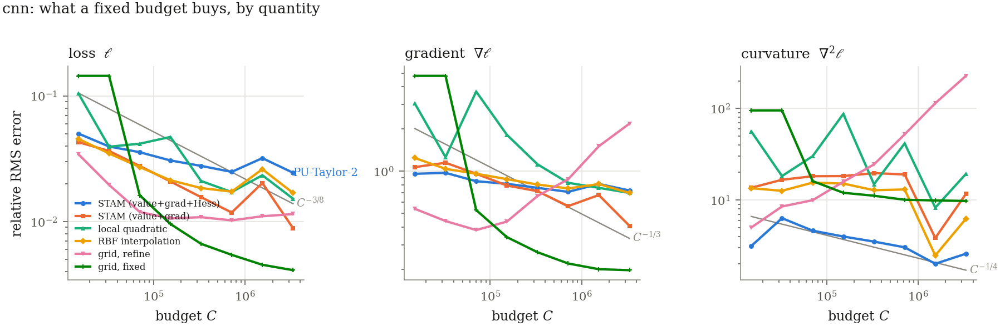
</p>

Direct Hessian probing (blue) sits one to two orders of magnitude below every value-only
method on curvature, and is the only method whose curvature error falls monotonically.

### 2. Sharpness read off a grid overstates the truth by 5×–41× (CNN) and 62×–113× (transformer)

"Sharpness" is the quantity most often *read off* these pictures. It is also the one a
grid estimates worst, and for two separate reasons that the experiment separates:

<p align="center">
  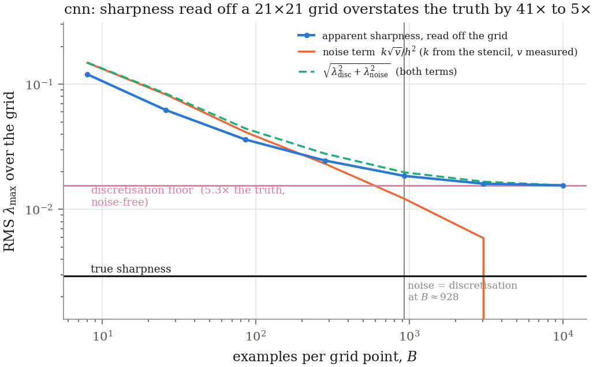
</p>

* a **noise term** `k·√v/h²`, with `k` fixed by the stencil and `v` measured — it matches
  the data with nothing fitted;
* a **discretisation floor** that survives even when the probe uses the *entire*
  evaluation set and its noise is exactly zero — still 5.3× the true curvature.

At sample sizes typical of a published landscape figure, essentially all of the apparent
sharpness is one or the other. The transformer shows the same two mechanisms at a larger
scale — 113× at `B=8`, still 62× when the probe uses the *entire* evaluation set:

<p align="center">
  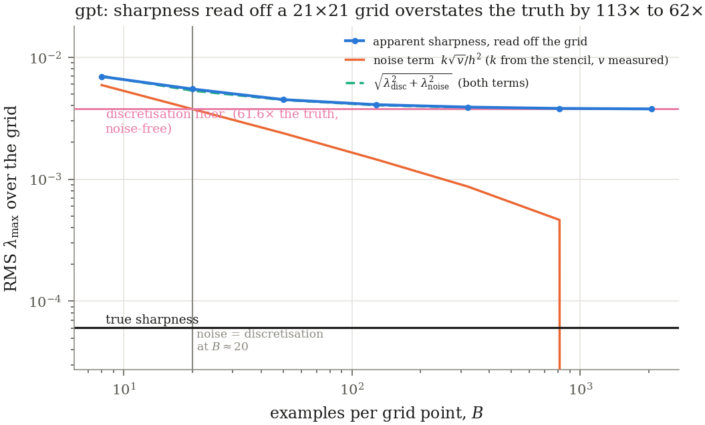
</p>

### 3. A budget has an optimum, and it is not where people spend it

Spending `C` on `n` probes of `B` examples each gives an error with two terms that pull
against each other:

$$E(n,B) \;\simeq\; \underbrace{c_1 M_3 R^3 n^{-3/2}}_{\text{approximation}} \;+\; \underbrace{c_2\,\sigma\,B^{-1/2}}_{\text{Monte Carlo}}, \qquad n(\tau + \kappa B) = C.$$

The minimum is at `n* ∝ C^(1/4)` with `E* ∝ (κσ²/C)^(3/8)` — the nonparametric minimax
rate for the smoothness assumed, so the scheme is rate-optimal rather than merely
reasonable. **Quadrupling the budget should buy √2 times as many probes, not four
times as many.** A fixed-resolution grid does the opposite.

<p align="center">
  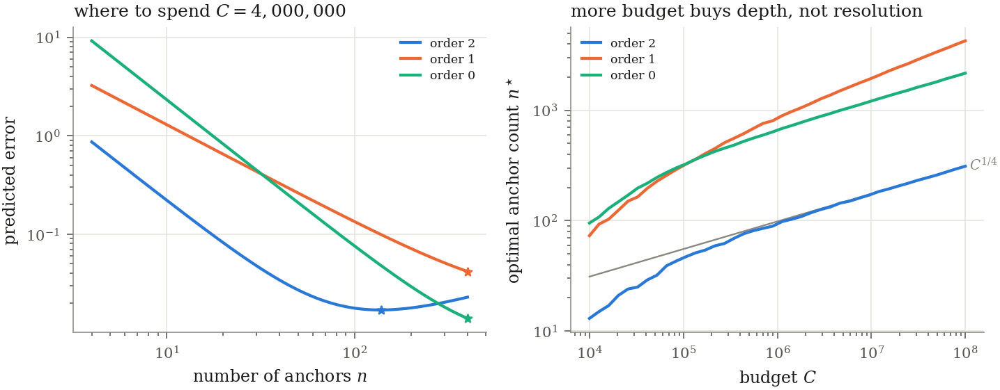
</p>

### 4. Every figure states its accuracy

<p align="center">
  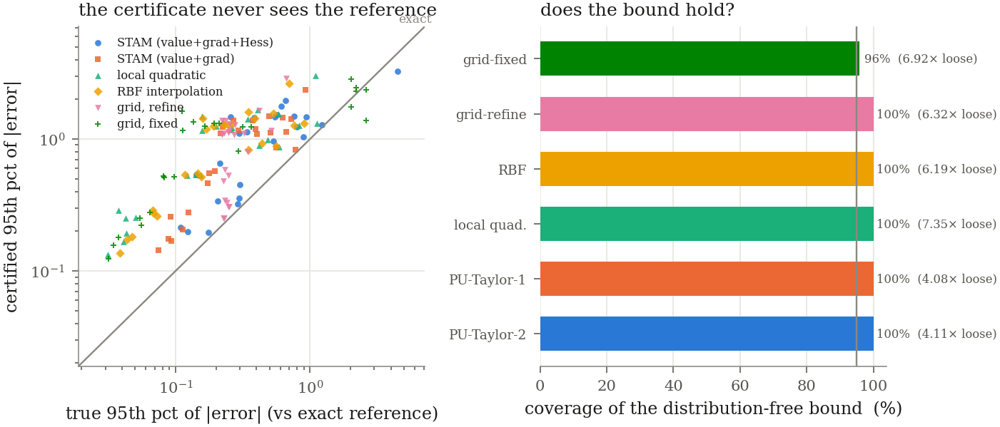
</p>

Independent stratified hold-out probes give a variance-corrected estimate of the
reconstruction's error. The certificate never sees the ground truth; the plot above
scores it against ground truth *after the fact*.

Getting this right required a correction we did not anticipate. The error field of a
landscape reconstruction is **heavy-tailed** — 89% of the total squared error comes from
1% of the domain, in the steep outer region — so a mean-based statement from the ~100
probes a certification slice affords systematically under-reports, and an
empirical-Bernstein bound built from the *observed* range can under-report with it. The
certified quantity is therefore a **quantile with a distribution-free order-statistic
bound**: "95% of this picture is within ε", which is both robust to the tail and what a
reader actually wants. Measured coverage is 96–100% against a nominal 95%.

Contour intervals are then set to at least twice the certified error, so **no contour is
drawn that the measurement cannot resolve**.

The transformer's error field is far less heavy-tailed — its loss saturates near `ln|V|`
rather than diverging — and the certificate is correspondingly tight there (1.6–3.1×
loose against 4–7× on the CNN), with 100% coverage:

<p align="center">
  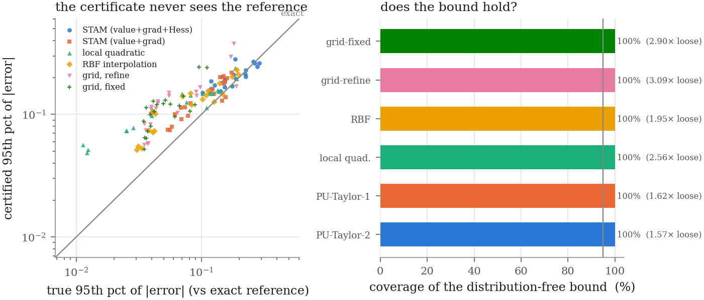
</p>

### 5. `ρ₂` is the wrong diagnostic, twice over

The captured-variance ratio is routinely quoted as evidence a plane is faithful.

<p align="center">
  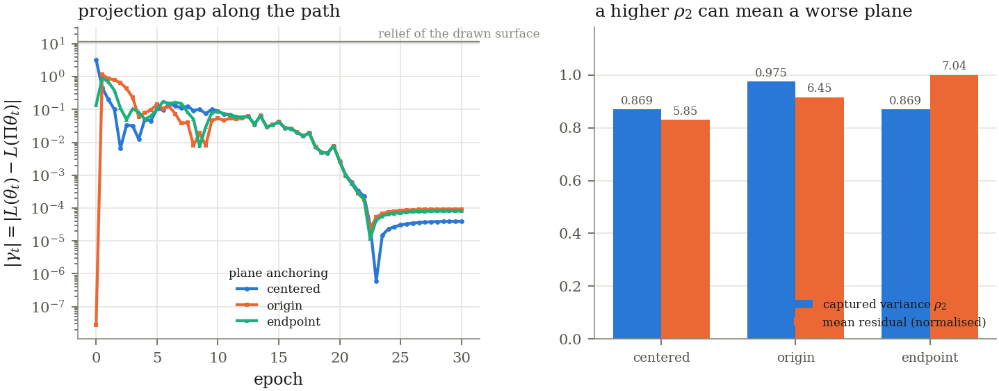
</p>

* It is not monotone in the parameter-space quantity it proxies: on **both** subjects the
  θ₀-anchored plane reports a *higher* ρ₂ (0.975 vs 0.869 on the CNN) while having a
  *larger* out-of-plane residual (6.45 vs 5.85). Preferring the larger ρ₂ selects the
  worse plane. (The Frobenius-optimal *affine* plane is centred at the trajectory mean;
  anchoring at θ₀ solves a different problem.)
* More usefully: **neither** ρ₂ nor the residual reliably predicts the thing that matters.
  On the CNN all three constructions give a projection gap of 0.6–0.9% of the surface's
  relief despite ρ₂ ranging over 0.87–0.98. On the transformer the ordering *is*
  informative but runs opposite to ρ₂: the mean-centred plane has the smallest gap (1.1%
  of relief) while the θ₀-anchored plane, with the highest ρ₂ of 0.991, has a larger one
  (1.6%).

So STAM reports the **projection gap** `γₜ = L(θₜ) − L(Πθₜ)` directly — the error a
reader makes reading the trajectory's height off the picture — in loss units against the
relief of the surface.

### 6. Honest negative result: derivative probing does *not* pay for the value surface

Measured cost multipliers are `κ₁ = 3.9` and `κ₂ = 20.8` (CNN), `κ₁ = 3.1` and
`κ₂ = 26.1` (transformer). Since `E* ∝ κ^(3/8)`, a second-order probe costs ~3× in error
on the value surface and buys back only ~1.8× through a smaller bias constant.

<p align="center">
  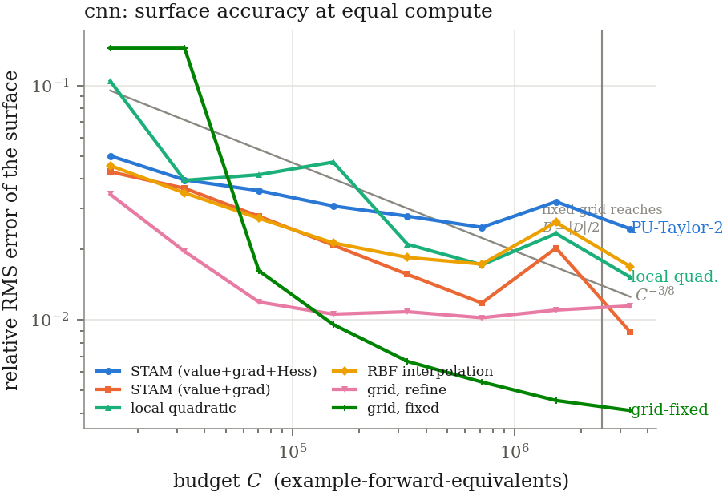
</p>

On the value surface a plain fixed grid is competitive and, at large budgets on this
small evaluation set, better. We report that as measured. The case for derivative
probing rests on the gradient and curvature fields, where it is not close.

---

## The animated mini-batch surface, drawn only where the model holds

<p align="center">
  
</p>

<p align="center">
  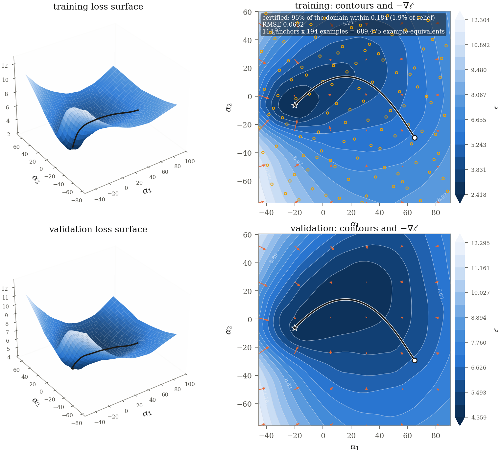
</p>

An optimiser never descends the plotted surface; at step `t` it sees `ℓ_{Bₜ}`. Using the
recorded mini-batch gradient and the *analytic* gradient of the rendered surface, the
realised projected noise is `ηₜ = V g_{Bₜ} − ∇R(αₜ)`, and the first-order model is
`R + ηₜᵀ(α − αₜ)`.

A linear model extrapolates without limit, so it needs a stated domain of validity rather
than a decorative envelope. The tilt is drawn only inside `ρₜ = ε/‖ηₜ‖` — the radius at
which the tilt itself reaches the tolerance — tapered by a Wendland window so the surface
stays C². **The trust radius is drawn on the figure.** It differs by an order of magnitude between
the two subjects — 47.4% of the domain radius on the CNN, 4.6% on the transformer — and
by another order of magnitude *within* a single run. That spread is the argument: an
envelope width chosen by hand cannot be right for both, so a "breathing landscape"
animation that fixes one is asserting a region of validity rather than deriving it. A
zoom panel renders the tilt at whatever magnification it happens to exist at.

---

## Machine-checked foundations

Six statements are formalised in Lean 4 with mathlib, checking with no `sorry` and no
axioms beyond Lean's three (`propext`, `Classical.choice`, `Quot.sound`):

| theorem | content |
|---|---|
| `alloc_lower_bound`, `alloc_attained` | the budget optimum `4(ab³/27)^(1/4)` and its attainment |
| `pu_error_bound` | a partition of unity carries local accuracy to global with no loss |
| `interpolation_floor` | an interpolant's error at its nodes *is* the noise |
| `debias_unbiased` | the variance-corrected certificate is unbiased |
| `sum_dist_sq_center` | why the optimal affine plane is centred at the mean |
| `taylor2_patch_bound` | the `⅙M₃h³` patch remainder |

What is *not* formalised — the minimax lower bound, the rate separation, the
concentration inequality — is cited, not claimed. The formalised parts are the ones where
an error would be ours.

```bash
cd proofs/StamCert && lake build
```

---

## Method

Second-order information is nearly free on a plane, and that is what the whole design
turns on. The exact restricted gradient `V∇L ∈ ℝ²` is one backward pass; the exact
restricted Hessian `V∇²L Vᵀ ∈ ℝ²ˣ²` is **two Hessian-vector products, independently of
model size**. One probe returns a complete second-order Taylor model.

Those patches are blended with compactly supported Wendland C² weights normalised to a
partition of unity. Two properties matter: local accuracy transfers to global accuracy
with no constant lost, and quadratics are reproduced *exactly* for any anchor placement.
Because the blend is differentiable in closed form, the rendered quiver field is the
**exact gradient of the rendered surface** — pipelines that interpolate a gradient field
separately produce arrows that are not the gradient of the surface they are drawn on, and
the inconsistency is invisible.

```
pilot (4%)  →  allocate  →  probe + reconstruct (90%)  →  certify (6%)
```

The pilot measures σ, M₂ and M₃ from the problem at hand rather than assuming them; the
allocator solves for `(n, B)`; the certificate reports what was actually achieved.

---

## Implementation

Because fixed per-anchor overhead `τ` enters the optimum, **reducing it improves
attainable accuracy, not just wall-clock** — the implementation is not separable from the
method.

<p align="center">
  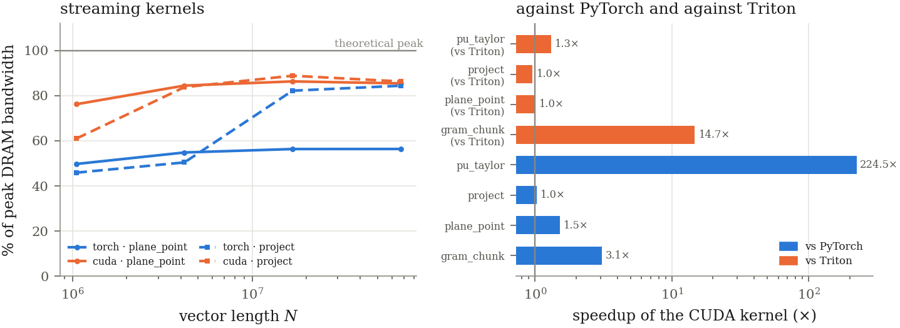
</p>

- **Flat parameters.** Every parameter tensor is rebound as a view into one contiguous
  buffer, gradients into a second. Writing a probe point is one copy instead of `Θ(P)`
  kernel launches; reading the gradient is zero-copy.
- **Four fused CUDA kernels.** `plane_point`, `project` (all basis dots in one pass over
  the gradient), `gram_chunk` (streamed in column blocks, so a multi-GB trajectory need
  not fit in device memory), `pu_taylor` (the reconstruction and its exact gradient).
  The streaming kernels reach **85–86% of peak DRAM bandwidth**; `pu_taylor` is **225×**
  the PyTorch path.
- **Adaptive by capability, not by generation.** The host layer reads `cudaDeviceProp`
  and derives the numerical policy: compensated (Neumaier) fp32 accumulation where fp64
  is rate-limited and native fp64 where it is not; fp16 trajectory storage where fp16
  arithmetic exists; **bf16 only where it is native** — PyTorch reports bf16 as supported
  on Turing via emulation, which is both slower and less accurate than fp32; 128-bit
  vector loads when alignment permits; block counts from the SM count. Reductions use a
  fixed block count and no float atomics, so results are bit-identical across runs.
  Compensated accumulation makes the fused projection **~800× more accurate** than the
  PyTorch reduction at N = 8.4M (4.4e-9 vs 3.6e-6).
- **Triton was written, benchmarked, and dropped.** All four kernels were also
  implemented in Triton. Hand-written CUDA won every operation — decisively on the
  trajectory Gram (**14.7×**; Triton's tile abstractions are mismatched to a `T×N` matrix
  with `T ~ 10²`) and on the reconstruction sweep; the two streaming kernels tie on
  bandwidth and are broken by accuracy. The tensor-core Gram path is faster still and
  returns 1.1e-2 relative error — four orders of magnitude worse — so it is not used.
  `runs/bakeoff_cuda_vs_triton.json` keeps the measurements.
- **Nothing requires a compiler.** Every result reproduces on the PyTorch path, only more
  slowly — which, per the theory, also means less accurately at a fixed budget.

---

## Subjects

<p align="center">
  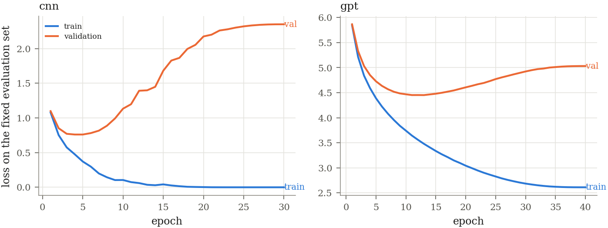
</p>

| | parameters | data | activation | why |
|---|---|---|---|---|
| CNN | 402,986 | CIFAR-10 | ReLU | loss only *piecewise* smooth — the hard case for any Taylor scheme |
| Transformer | 5,018,112 | WikiText-2 | GELU | C^∞, so the asymptotic theory applies without caveat |

Both trained with AdamW, cosine schedule, linear warm-up, no augmentation. Batch
normalisation is deliberately absent: it makes the loss scale-invariant in each
normalised layer, so distances in the plane carry no meaning — a real problem for
landscape visualisation, kept out of the error analysis rather than confounded with it.

Trajectory capture costs **−3.3%** (CNN, i.e. free within noise) and **+14.2%**
(transformer) of epoch time, measured against matched control epochs; the snapshot copies
overlap with compute on a separate stream.

**Which region to draw** is itself a stated criterion rather than a margin parameter. On
a box scaled to the whole CNN trajectory the loss reaches 479 at the corners against a
maximum of 4.2 anywhere the optimiser went, and an error quoted relative to that range
would be meaningless. The render domain is the largest box containing the whole
trajectory on which the loss stays within 3× the largest loss the optimiser itself
experienced. The transformer's loss saturates near `ln(vocab)`, so no restriction binds
there.

---

## Layout

```
stam/
  device.py       runtime GPU capability detection and numerical policy
  flat.py         contiguous parameter/gradient views
  models.py       the two landscape subjects
  data.py         fixed finite evaluation sets — the definition of the target
  capture.py      instrumented training with measured capture overhead
  basis.py        streaming-Gram trajectory PCA; centred/origin/endpoint planes
  probe.py        value, exact restricted gradient, exact restricted Hessian + variances
  design.py       anchor designs and the budget allocator
  reconstruct.py  PU-Taylor and the value-only baselines
  certify.py      the variance-corrected, quantile-based certificate
  fidelity.py     projection gap and plane diagnostics
  pipeline.py     pilot → allocate → probe → certify
  metrics.py      error metrics against the exact reference
  parallel.py     micro-batch autotuning and multi-GPU job execution
  kernels/        fused CUDA kernels with a PyTorch fallback
  api.py          LandscapeRecorder: the two-line training-loop hook
  viz/            style, static rendering, certified animation
examples/         quickstart: the package used on someone else's model
experiments/      01 train · 02 reference · 02b domain · 03 sweep · 04 landscape · 05 sharpness
bench/            kernel correctness tests, benchmark, pipeline smoke test
proofs/StamCert/  Lean 4 formalisation
paper/            LaTeX source; every number generated from run artefacts
figures/          figure generation, PDF for the paper and PNG for this page
```

## Reproducing

```bash
make all          # everything, end to end
make kernels      # correctness tests + benchmark
make train        # both subjects, one per GPU
make reference    # exact full-dataset reference surfaces (sharded across GPUs)
make sweep        # the budget-error study
make landscape    # certified figures + animation
make sharpness    # the noise-vs-sharpness study
make figures      # rebuild every figure from the recorded artefacts
make paper        # regenerate numbers, tables and figures; compile the PDF
make proofs       # Lean
```

Requirements: PyTorch with CUDA, `scipy`, `matplotlib`, `datasets`, `tokenizers`. A CUDA
toolkit matching PyTorch's is located automatically, including a repo-local one under
`.toolchain/`. TeX Live for the paper; `elan`/`lake` for the proofs.

The paper contains no hand-typed experimental numbers: `paper/make_numbers.py`
regenerates every macro, table and figure block from the JSON artefacts, so text and
results cannot disagree. Missing artefacts render as a visible `[pending]` rather than a
plausible value.

## Scope

- A 2-plane still hides most of the space. Nothing here makes it adequate; it makes the
  inadequacy *measurable*, and a large projection gap is a reason to distrust the figure.
- `M₃` is not finite for ReLU networks in the classical sense. The asymptotic rate is a
  statement about the smoothed, data-averaged loss; the empirical certificate is what
  carries the ReLU case, and it assumes nothing.
- The certificate bounds a quantile and a mean, not a supremum. Finitely many probes do
  not support a sup-norm claim.
- Normalisation layers are out of scope: scale invariance makes distances in the plane
  meaningless, and composing filter normalisation with this analysis is not studied here.
- Two subjects, one optimiser. The theory is not model-specific; the constants are.

## License

Released under the [Apache License 2.0](LICENSE).
